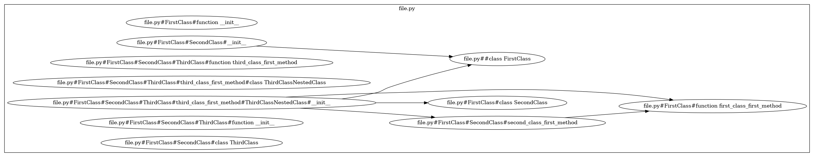
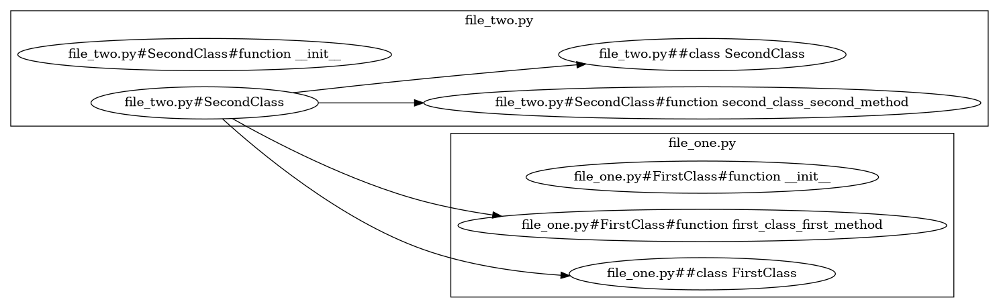
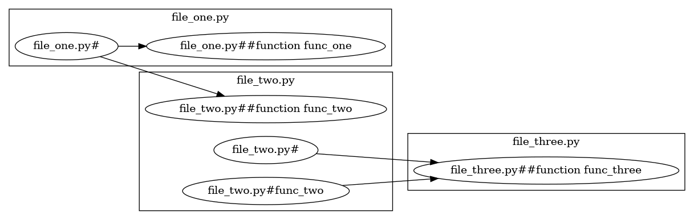

# CodeBlocks

Represent a Python project in a graphical way.

## How it works

1. A `Parser` is created.

1. The `Parser` then *consumes* all the .py files in the project directory.

1. For each file, all function and class *definitions* and *references* are located using the `ast` library.

1. For each function and class reference, its definition is located using the Language Server Protocol, using the `sansio-lsp-client` library.

1. For each reference, an arrow is created from the current *location* (defined as path.to.file.class.function), to the target *location*.

1. For each function and class definition/reference, a node is created for their *location*s.

1. Finally, the nodes and arrows are graphed using the `graphviz` library.

## How to use it

```sh
$ python code_blocks/main.py --project path/to/project/root --output path/to/output.gv
```

## Example

### One files example

```sh
$ python code_blocks/main.py --project examples/one_file --output examples/one_file/code_blocks.gv
```



### Two files examples

```sh
$ python code_blocks/main.py --project examples/two_files --output examples/two_files/code_blocks.gv
```



### Three files example

```sh
$ python code_blocks/main.py --project examples/three_files --output examples/three_files/code_blocks.gv
```

