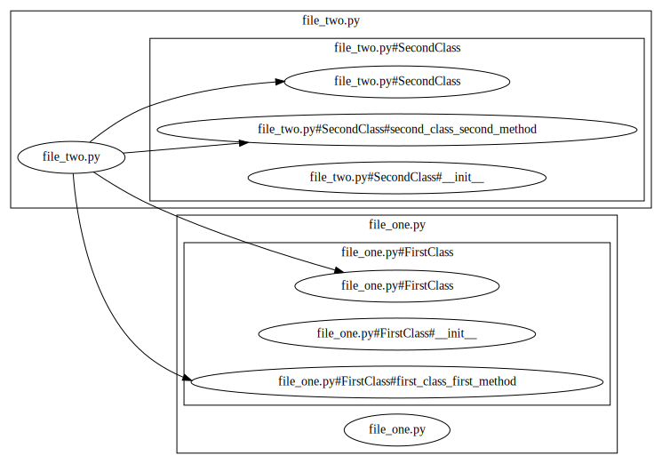
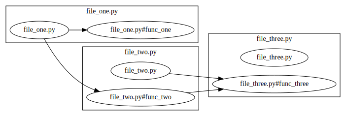

# CodeBlocks

Represent a Python project in a graphical way.

## How it works

1. A `Parser` is created.

1. The `Parser` then *consumes* all the .py files in the project directory.

1. For each file, all function and class *definitions* and *references* are located using the `ast` library.

1. For each function and class reference, its definition is located using the Language Server Protocol, using the `sansio-lsp-client` library.

1. For each reference, an arrow is created from the current *location* (defined as path.to.file.class.function), to the target *location*.

1. For each function and class definition/reference, a node is created for their *location*s.

1. Finally, the nodes and arrows are graphed using the `graphviz` library.

## How to use it

```sh
$ python code_blocks/main.py --project path/to/project/root --output path/to/output.gv
```

## Example

### One file example

#### examples/one_file/file.py

```py
class FirstClass:
    def __init__(self) -> None:
        pass

    def first_class_first_method(self):
        pass


class SecondClass:
    def __init__(self) -> None:
        self.fc = FirstClass()

    def second_class_first_method(self):
        self.fc.first_class_first_method()


class ThirdClass:
    def __init__(self) -> None:
        pass

    def third_class_first_method(self):
        class ThirdClassNestedClass:
            def __init__(self) -> None:
                fc = FirstClass()
                fc.first_class_first_method()

                sc = SecondClass()
                sc.second_class_first_method()
```

#### Result

```sh
$ python code_blocks/main.py --project examples/one_file --output examples/one_file/code_blocks.gv
```


### Two files examples

#### examples/two_files/file_one.py

```py
class FirstClass:
    def __init__(self):
        pass

    def first_class_first_method(self):
        pass
```

#### examples/two_files/file_two.py

```py
from file_one import FirstClass


class SecondClass:
    def __init__(self):
        pass

    def second_class_second_method(self):
        pass


if __name__ == "__main__":
    fc = FirstClass()
    fc.first_class_first_method()

    sc = SecondClass()
    sc.second_class_second_method()
```

#### Result

```sh
$ python code_blocks/main.py --project examples/two_files --output examples/two_files/code_blocks.gv
```



### Three files example

#### examples/three_files/file_one.py

```py
from file_two import func_two


def func_one():
    pass


func_one()
func_two()
```

#### examples/three_files/file_two.py

```py
from file_three import func_three


def func_two():
    func_three()


func_three()
```

#### examples/three_files/file_three.py

```py
def func_three():
    pass
```

```sh
$ python code_blocks/main.py --project examples/three_files --output examples/three_files/code_blocks.gv
```



### Large codebase ([black](https://github.com/psf/black))


